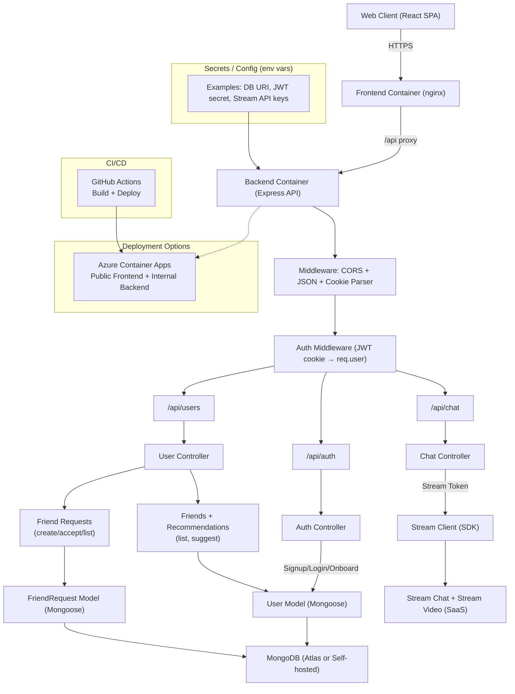

# Marmalade

A full-stack language-exchange app where learners can discover partners, send friend requests, chat 1:1, and start video calls.

**Tech stack**
- Frontend: React + Vite, Tailwind + DaisyUI, TanStack Query
- Backend: Node.js + Express, MongoDB (Mongoose), JWT auth
- Realtime: Stream Chat + Stream Video

## Requirements
- Node.js 18+ (or newer LTS)
- MongoDB (local or Atlas)
- Stream account (Chat + Video)

## Setup
1. Install dependencies
   - `npm install --prefix backend`
   - `npm install --prefix frontend`

2. Create backend environment file  
   Create `backend/.env` with:
   ```
   PORT=5001
   NODE_ENV=development
   MONGO_URI=your_mongodb_connection_string
   JWT_SECRET_KEY=your_jwt_secret
   STREAM_API_KEY=your_stream_api_key
   STREAM_API_SECRET=your_stream_api_secret
   ```

3. Create frontend environment file  
   Create `frontend/.env` with:
   ```
   VITE_STREAM_API_KEY=your_stream_api_key
   ```

## Run locally (dev)
1. Start the backend
   - `npm run dev --prefix backend`

2. Start the frontend (in a new terminal)
   - `npm run dev --prefix frontend`

3. Open the app
   - `http://localhost:5173`

The backend runs on `http://localhost:5001`, and the frontend proxies requests to it.

## Production containers
Production v1 uses two containers on Azure Container Apps:

- Frontend: public nginx container serving the Vite build and proxying `/api` to the backend.
- Backend: private/internal Express API container.

For full local container verification:

```
docker compose up --build
```

Then open `http://localhost:8080`.

## Deployment
- Container Apps (Azure): `docs/CONTAINER-APPS.md`
- DevOps and Cloud: `docs/DEVOPS.md`

## Architecture


## What you need to run this project
- A MongoDB connection string in `MONGO_URI`
- Stream Chat + Stream Video credentials:
  - `STREAM_API_KEY`
  - `STREAM_API_SECRET`
  - `VITE_STREAM_API_KEY` (frontend)
- A strong `JWT_SECRET_KEY` for auth

## Notes
- CORS is set to allow `http://localhost:5173` in development.
- In production, nginx serves the built frontend and proxies `/api` to the internal backend.
